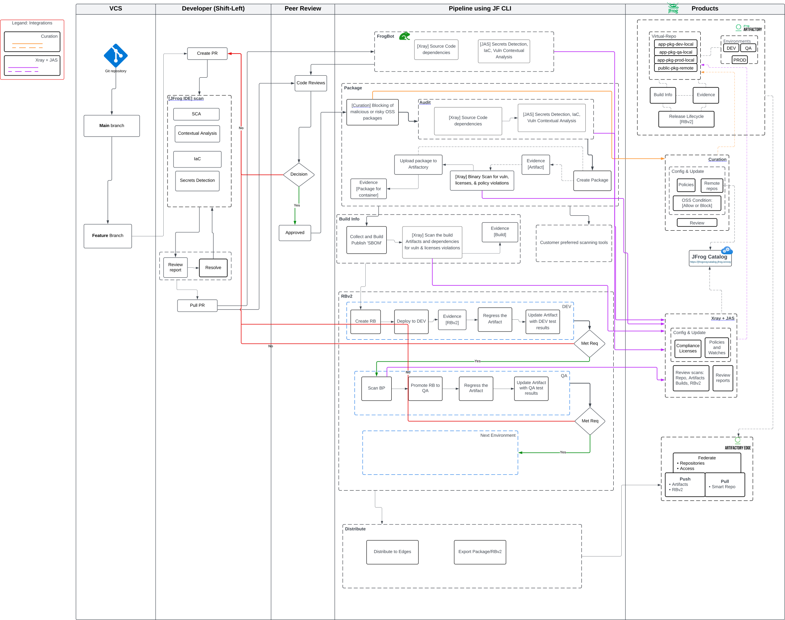
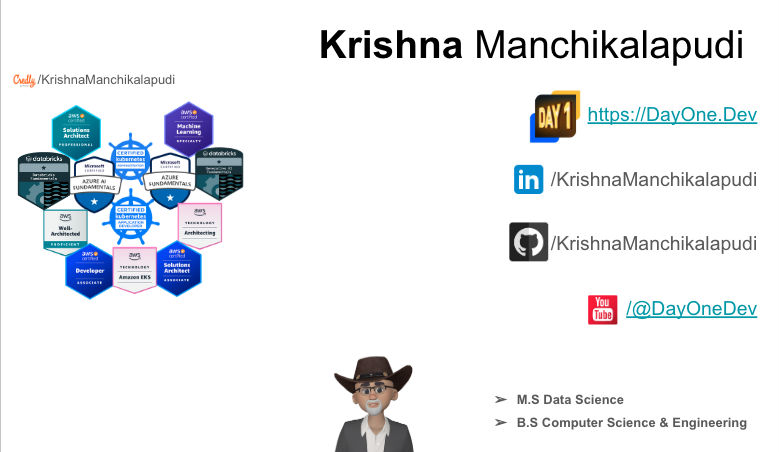

# Python Flask TODO List app

## Prerequisites
- Read and understand the application from [../ReadME.MD](../READM.md)

## Objective
Develop a DevOps pipeline to automate tasks such as code compile, unit testing, creation of container, and upload of artifacts to a repository. This will streamline the software development process using JFrog CLI.

## Pipeline: Flow Diagrams
### DevOps pipeline using JFrog Products



## LAST UMCOMMIT
`````
git reset --hard HEAD~1
git push origin -f
`````

## License
The application is released under [MIT License](https://mit-license.org/).



